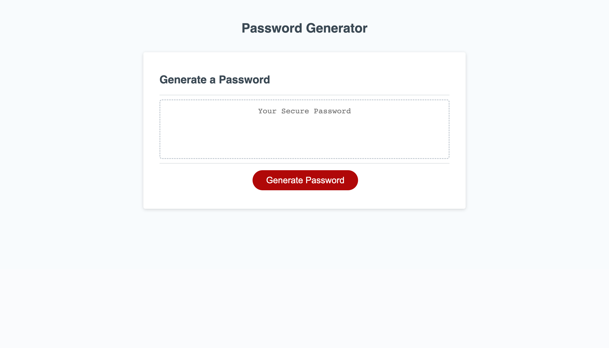

# Password-Generator

## Creating a password generator to help users create a randomized password based on their preferences of lowercase, uppercase, numeric, and/or special characters.

This is a password generator that asks questions about user preferences for their password. It must have :
- A length of at least 8 characters and no more than 128 characters
- Whether or not to include lowercase, uppercase, numeric, and/or special characters
- User preferences start with default but get changed by the user prompts
- A password is generated that matches the selected criteria
- User has to either confirm or cancel their preferences and choose atleast one of the options. 

## Installation

N/A

## Usage
- This is the link to the deployed website

## Credits

N/A

## License

Please refer to the LICENSE in the repo.